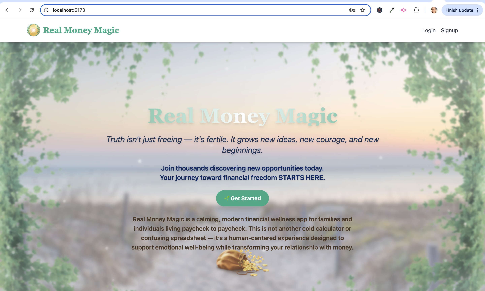
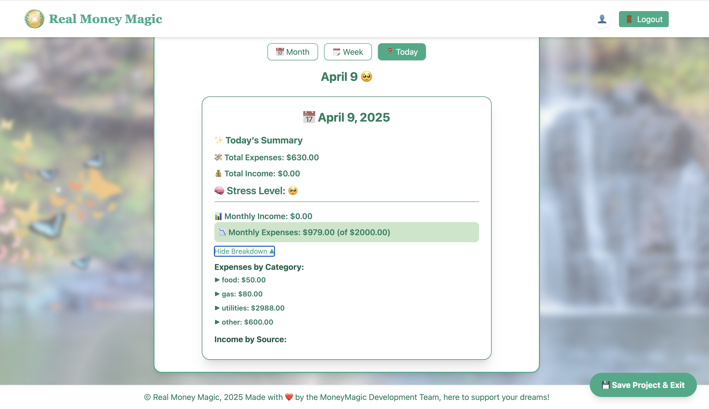

# 💸 Real Money Magic

**Real Money Magic** is a calming, modern financial wellness app for families and individuals living paycheck to paycheck. This is *not* another cold calculator or confusing spreadsheet — it’s a human-centered experience designed to support emotional well-being while transforming your relationship with money.

> 💡 *"Face your financial reality, explore your options, and find peace of mind at last."*

---

## 🎯 Purpose & Audience

- Designed for the **65% of Americans** living paycheck to paycheck
- Supports **parents**, **gig workers**, and individuals with **irregular income**
- Created to feel like a **mentor, not a math class**
- For users seeking peace, clarity, and control over their finances

---

## ✨ Key Features

| Feature                    | Description                                                                 |
|---------------------------|-----------------------------------------------------------------------------|
| **Beautiful, Soothing UI**| Nature themes, uplifting quotes, family photos                              |
| **Simple Daily Tracking** | Instantly log income or expenses, or scan receipts (Pro)                    |
| **Visual Money Cards**    | Track "Money In" and "Money Out" in real-time                              |
| **Weekly & Monthly Reports** | Auto-generated every Friday and month-end                                |
| **Income Planner**        | Set a dream income goal and receive job/training suggestions                |
| **AI Career Coach**       | Personalized suggestions for short-term training & high-paying jobs         |
| **Funding Finder**        | Scholarships, grants, and local assistance programs                         |
| **Stress Level Logging**  | Optional input from 1 (calm) to 10 (overwhelmed) for insight tracking       |
| **Saved Login**           | Secure login with JWT + session persistence                                |

---

## 📸 UI Previews (Coming Soon)

| Landing Page | Budget View | Calendar Tracker |
|----------------|-------------|------------------|
|  |  |  |

> Once the frontend polish is complete, we’ll showcase key screens to give users a visual feel for Real Money Magic’s calming design core features, and more.

---

## 🧠 The Vision

Families don’t just need to "budget better" — they need to **feel better** about money. Financial stress affects mental health, relationships, and children’s development. This app is a love letter to every hardworking person who deserves peace and prosperity.

---

## 🛠️ Tech Stack

| Layer       | Technology                     |
|-------------|----------------------------------|
| Frontend    | React (Vite) + Tailwind CSS     |
| Backend     | FastAPI + Strawberry GraphQL    |
| Database    | MongoDB (with Beanie ODM)       |
| Auth        | JWT (JSON Web Tokens)           |
| AI Services | OpenAI + Google Vision API      |
| Hosting     | Render (Production)             |

---

## 🚀 Getting Started (Quick)

To get the project running locally:

```bash
# 1. Clone the repo
https://github.com/your-team/real-money-magic.git

# 2. Backend setup
cd server
python -m venv venv
source venv/bin/activate
pip install -r requirements.txt
uvicorn app.main:app --reload

# 3. Frontend setup
cd ../client
npm install
npm run dev
```

> For full details, see [`READMeSetup.md`](./READMeSetup.md)

---

## 🔐 Environment Variables

Backend `.env`:
```env
MONGO_URL=mongodb+srv://<db_username>:<db_password>@rmm-db.wkyhujn.mongodb.net/realmoneydb?retryWrites=true&w=majority&appName=RMM-DB

JWT_SECRET=your_generated_jwt_secret
```

Frontend `.env`:
```env
VITE_API_URL=http://localhost:8000/graphql
```

---

## 📂 File Structure

```bash
real-money-magic/
├── server/       # FastAPI backend with Strawberry GraphQL
│   ├── app/
│   ├── auth/
│   ├── models/
│   ├── graphql/
│   ├── routes/
│   └── utils/
│
├── client/       # Vite + React frontend
│   ├── src/
│   │   ├── components/
│   │   ├── screens/
│   │   ├── graphql/
│   │   ├── types/
│   │   ├── utils/
│   │   ├── api/
│   │   └── css/
│
├── README.md
└── READMeSetup.md
```

---

## ✅ Core Functionality Complete

- [x] Authentication (JWT)
- [x] Login + Signup (Frontend + Backend)
- [x] GraphQL support (modular query/mutation structure)
- [x] MongoDB Atlas connection (via Beanie)
- [x] Local testing with pytest
- [x] Protected routes and token refresh system
- [x] Project-specific budget saving (basic version)
- [x] Profile system with multiple project support
- [x] Project system (limit 3 per user) (in progress)
- [ ] Shared project access (multiple users per project) (in progress)
- [x] Daily expense tracker
- [ ] Stress level tracker UI (planned)
- [ ] Receipt scanner (planned)
- [ ] AI career/income suggestions (planned)

---

## 📈 Future Development Ideas

- 🌍 Multi-language support (i18n)
- 📱 Mobile-first native app (React Native)
- 💾 Saved sessions + encrypted local storage
- 🔔 Push notifications for income/spending alerts
- 🧠 AI-driven insights based on spending/emotion patterns
- 📊 Budget + calendar integration per user project
- 💬 Family sharing & permission-based data views

---

## 🌐 Deployment

- **Frontend**: [Live StaticSite](https://realmoneymagicfrontend.onrender.com)
- **Backend**: [Deployed WebService](https://realmoneymagic.onrender.com)
- **GraphQL Interface**: [Strawberry GraphQL](https://realmoneymagic.onrender.com/graphql)

---

## 🙌 Team Credits

- **Alex** – Lead Developer: Backend & Frontend Dev **|** System Design **|** GraphQL Logic
- **Jen** – Lead Developer: Founder & Frontend Dev **|** UI Design

---

## 💬 Contact & Support

For help, bugs, or questions — open an issue or contact Alex through the GitHub repo.

> *“We built Real Money Magic to help real families reclaim their peace. Let’s make that magic real together.”* ✨

